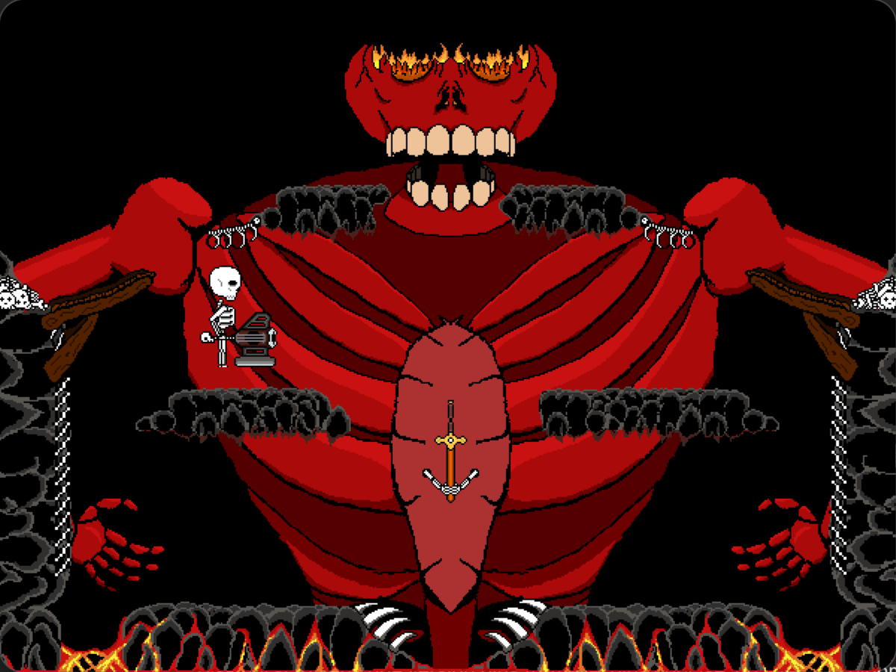

# impossible_battle_boss



# Instructions de Compilation


## Dépendances


*   Git (pour cloner le projet)
*   CMake (>= 3.22)
*   Un compilateur C++20 (g++, clang++)
*   OpenGL (GL, GLU, GLUT)
*   LibPNG
*   Pthreads
*   X11

### 1. Installation des dépendances

#### Ubuntu / Debian


```bash
sudo apt-get update
sudo apt-get install git cmake build-essential libglu1-mesa-dev freeglut3-dev mesa-common-dev libpng-dev libx11-dev
```

#### Arch Linux


```bash
sudo pacman -Syu --noconfirm git cmake base-devel glu freeglut libpng libx11
```

#### macOS

1.  **Installez Xcode Command Line Tools**:
    ```bash
    xcode-select --install
    ```

2.  **Installez Homebrew** (si ce n'est pas déjà fait) :
    ```bash
    /bin/bash -c "$(curl -fsSL https://raw.githubusercontent.com/Homebrew/install/HEAD/install.sh)"
    ```

3.  **Installez les dépendances via Homebrew** :
    ```bash
    brew install cmake libpng
    ```


### 2. Compiler le projet

Les étapes suivantes sont communes à tous les systèmes (exécutez-les depuis la racine du projet) :

```bash
mkdir build
cd build
cmake ..
make
```

### 3. Exécuter

```bash
./ImpossibleBattleBoss
```
